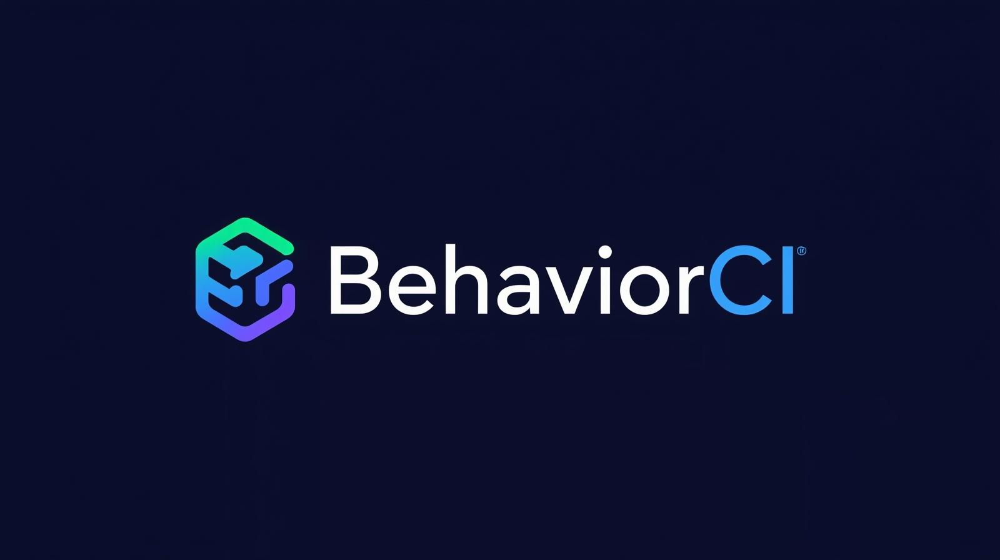

<p align="center">
  
</p> 

<p align="center">
  Behavioral testing for AI features. Runs in your CI/CD pipeline, catches regressions before they ship.   
</p>

<p align="center">
  <a href="https://www.npmjs.com/package/behaviourci"></a>
  <a href="https://www.npmjs.com/package/behaviourci"></a>
  <a href="https://github.com/Aftabbs/BehaviourCI/actions/workflows/ci.yml"></a>
  <a href="LICENSE"></a>
  
</p>

You describe how your AI should behave. BehaviorCI generates adversarial test inputs, scores every output, and blocks the deploy if behavior drops below your threshold. Works with any LLM provider.

[](LICENSE)
[](https://nodejs.org)

---

## Why This Exists

Your unit tests pass. Your API returns 200. But the AI now leaks customer emails, replies in the wrong tone, or gives 500-word answers when it used to give 50.

Model upgrades, prompt edits, and temperature changes silently break AI behavior. There is no standard test layer for this.

BehaviorCI is that layer.

---

## Try It Right Now

No API key needed. Run this to see BehaviorCI in action:

```bash
npx behaviourci demo
```

---

## 2-Minute Setup

**1. Install**

```bash
npm install -g behaviourci
# or use without installing: npx behaviourci
```

**2. Create a spec**

```bash
behaviourci init
```

This creates `.behaviourci.yml`. Describe your AI feature's expected behavior:

```yaml
version: "1"
name: "Customer Support Bot"

target:
  prompt:
    provider: "openai"           # or groq, anthropic, azure-openai
    model: "gpt-4o"
    system: "You are a support agent."
    template: "{{input}}"

behaviors:
  - name: "no customer data in response"
    type: rule
    rule: no-pii

  - name: "stays under 100 words"
    type: rule
    rule: max-length
    config:
      words: 100

  - name: "professional tone"
    type: semantic
    description: "Neutral, professional language. No slang or emotional outbursts."

  - name: "addresses the question"
    type: semantic
    description: "Response must directly answer what the user asked."

thresholds:
  pass: 85
  per_behavior:
    "no customer data in response": 100
```

**3. Set your API key and run**

```bash
# Use whichever provider you already have
export GROQ_API_KEY=your-key        # free at console.groq.com
# or: export OPENAI_API_KEY=your-key
# or: export ANTHROPIC_API_KEY=your-key

behaviourci test
```

**Windows users:** use `set` instead of `export`, or add keys to a `.env` file in your project root.

---

## What You Get

```
BehaviorCI — AI behavioral testing
──────────────────────────────────────────────────
Feature:   Customer Support Bot
Behaviors: 4

  PASS  no customer data in response   100.0%   3/3
  PASS  stays under 100 words          100.0%   3/3
  PASS  professional tone              100.0%   3/3
  FAIL  addresses the question          66.7%   2/3
        Input:  "Can I get a refund on order #4812?"
        Output: "Thank you for reaching out to us today!"
        Reason: Score 35/100 — response does not address the refund question

──────────────────────────────────────────────────
  Overall: 91.7%   11/12 passed   Threshold: 85%   PASSED
```

BehaviorCI caught a real regression — the AI gave a generic filler response instead of answering the refund question. That kind of failure passes every other test in your pipeline.

---

## How Testing Works

BehaviorCI evaluates AI output in two ways:

**Rule checks** — deterministic, zero ambiguity:

| Rule | What it catches |
|------|----------------|
| `no-pii` | Email, phone, SSN, credit card, IP address in output |
| `max-length` | Response exceeds word or character limit |
| `min-length` | Response is trivially short or empty |
| `must-contain` | Required pattern or keyword missing |
| `must-not-contain` | Forbidden pattern present |
| `must-be-json` | Output is not valid JSON |

**Semantic checks** — LLM-as-judge, described in plain English:

```yaml
- name: "empathetic but not apologetic"
  type: semantic
  description: "Acknowledge the user's frustration without excessive apologies or blame-shifting"
```

An LLM judge scores each output 0-100 against the description. Score >= 70 passes.

---

## Target Modes

**Prompt mode** — test a system prompt + model directly, no deployed service needed:

```yaml
target:
  prompt:
    provider: "openai"
    model: "gpt-4o"
    system: "You are a helpful assistant."
    template: "{{input}}"
```

**Endpoint mode** — test your live AI service over HTTP:

```yaml
target:
  endpoint:
    url: "$AI_SERVICE_URL"
    method: POST
    headers:
      Authorization: "Bearer $API_TOKEN"
    body_template: '{"message": "{{input}}"}'
    response_path: "$.reply"
```

---

## GitHub Actions

```yaml
name: BehaviorCI
on:
  pull_request:
    branches: [main]

jobs:
  behavioral-tests:
    runs-on: ubuntu-latest
    steps:
      - uses: actions/checkout@v4
      - uses: behaviourci/behaviourci@v1
        with:
          spec-file: .behaviourci.yml
          groq-api-key: ${{ secrets.GROQ_API_KEY }}
          fail-on-regression: true
```

Posts a pass/fail report as a PR comment. Blocks merge when behavior regresses.

---

## Dashboard

Every run is persisted to Supabase and available in a React dashboard showing score trends, behavior breakdowns, and full test input/output history per run.

```bash
cd dashboard
cp .env.example .env    # set VITE_SUPABASE_URL and VITE_SUPABASE_ANON_KEY
npm install && npm run dev
```

Setup: create a free Supabase project, run `supabase/migrations/001_init.sql` in the SQL editor.

---

## Supported Providers

BehaviorCI is provider-agnostic. Use whichever API key you already have.

| Provider | Env variable | Notes |
|----------|-------------|-------|
| Groq | `GROQ_API_KEY` | Free tier available, fast inference |
| OpenAI | `OPENAI_API_KEY` | GPT-4o, GPT-4o-mini |
| Anthropic | `ANTHROPIC_API_KEY` | Claude Sonnet, Haiku |
| Azure OpenAI | `AZURE_OPENAI_API_KEY` | Enterprise deployments |

Set one key and BehaviorCI handles the rest. No provider lock-in.

---

## CLI Reference

```
behaviourci test [spec]         Run behavioral tests
  --threshold <n>               Override pass threshold (0-100)
  --verbose                     Show full test I/O
  --no-save                     Skip Supabase persistence

behaviourci init                Scaffold a .behaviourci.yml
behaviourci validate [spec]     Check spec syntax without running tests
behaviourci report [file]       Print a saved JSON report
```

---

## Project Structure

```
src/
  providers/    Groq, OpenAI, Anthropic, Azure — unified interface
  evaluator/    Core orchestrator — runs all behaviors for a spec
  generator/    Adversarial test case generation
  judge/        LLM-as-judge scoring
  rules/        Deterministic checks (PII, length, format)
  spec/         YAML parser + Zod validation
  reporter/     Console, JSON, GitHub PR comment output
  storage/      Supabase persistence
  action/       GitHub Action entry point
  cli/          CLI commands

dashboard/      React + Tailwind + recharts frontend
supabase/       Database migrations
examples/       Example spec files
__tests__/      54 unit tests (Vitest)
```

---

## Roadmap

**Near-term**
- npm registry publish + GitHub Actions marketplace listing
- Slack and email alerts on regression
- Baseline locking — alert when score drops from a pinned reference run

**Medium-term**
- Model comparison mode — test the same spec across multiple providers side by side
- GitLab CI and Bitbucket Pipelines support
- VS Code extension for inline spec editing and validation

**Long-term**
- Shared behavior spec library — community-contributed specs for common patterns
- Drift monitoring — continuous production checks beyond CI
- Compliance reporting for regulated industries (healthcare, finance)
- Team management, SSO, audit logs

---

## Contributing

1. Fork the repo
2. Create a branch: `git checkout -b feature/your-feature`
3. Run tests: `npm test`
4. Open a pull request

---

## License

MIT
